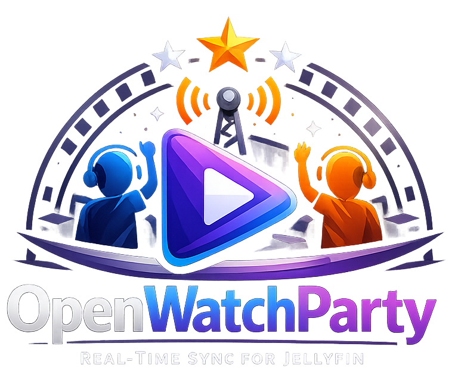

<p align="center">
  
</p>

<p align="center">
  <strong>Watch movies together, no matter the distance.</strong>
</p>

<p align="center">
  <a href="#quick-start">Quick Start</a> •
  <a href="#features">Features</a> •
  <a href="https://mhbxyz.github.io/OpenWatchParty/">Documentation</a> •
  <a href="#contributing">Contributing</a>
</p>

<p align="center">
  <a href="https://github.com/mhbxyz/OpenWatchParty/actions/workflows/ci.yml"></a>
  
  
  
</p>
<p align="center">
  
  <a href="https://github.com/pre-commit/pre-commit"></a>
  
</p>

---

OpenWatchParty enables synchronized media playback for [Jellyfin](https://jellyfin.org/). Host a watch party, invite your friends, and enjoy movies together — perfectly in sync.

**Two components:**
- **Jellyfin Plugin** — Integrates the UI into Jellyfin's web interface
- **Session Server** — Standalone Rust server that manages rooms and synchronization

## Features

| Feature | Description |
|---------|-------------|
| 🎬 **Real-time Sync** | Play, pause, and seek — everyone stays together |
| 🏠 **Room System** | Create or join watch parties with a single click |
| ⚡ **Drift Correction** | Automatic playback speed adjustment keeps everyone aligned |
| 🔒 **Optional Auth** | JWT-based authentication for private sessions |
| 🎨 **Native UI** | Integrated into Jellyfin's web interface |
| 🌐 **HLS Support** | Works with Jellyfin's adaptive streaming |

## Installation

### For Users

Install OpenWatchParty on your existing Jellyfin server in minutes.

#### 1. Deploy the Session Server

```bash
docker run -d --name owp-session -p 3000:3000 \
  -e ALLOWED_ORIGINS="http://your-jellyfin:8096" \
  ghcr.io/mhbxyz/openwatchparty-session-server:latest
```

#### 2. Install the Plugin

1. Go to **Dashboard** → **Plugins** → **Repositories**
2. Add repository:
   ```
   https://mhbxyz.github.io/OpenWatchParty/jellyfin-plugin-repo/manifest.json
   ```
3. Go to **Catalog** → Find **OpenWatchParty** → **Install**
4. Restart Jellyfin

#### 3. Enable the Client Script

1. Go to **Dashboard** → **General** → **Custom HTML**
2. Add:
   ```html
   <script src="/web/plugins/openwatchparty/plugin.js"></script>
   ```
3. Click **Save** and hard refresh (`Ctrl+F5`)

#### 4. Start Watching Together

1. Play any video in Jellyfin
2. Click the **Watch Party button** (group icon in the header)
3. **Create a room** and share the name with friends
4. Friends join your room — when you play, pause, or seek, everyone follows along

> See the [Installation Guide](https://mhbxyz.github.io/OpenWatchParty/operations/installation.html) for detailed instructions and configuration options.

---

### For Developers

Set up a complete development environment with hot reload.

#### Prerequisites

- [Docker](https://docs.docker.com/get-docker/) and Docker Compose
- Git

#### 1. Clone and Start

```bash
git clone https://github.com/mhbxyz/OpenWatchParty.git
cd OpenWatchParty
make up
```

This builds the plugin and starts both Jellyfin (`localhost:8096`) and the session server (`localhost:3000`).

#### 2. Enable the Client Script

Follow step 3 from the user installation above.

#### 3. Development Commands

```bash
make dev      # Start stack and follow logs
make watch    # Auto-restart on JS file changes
make test     # Run tests
make lint     # Run linters
```

> See the [Development Setup Guide](https://mhbxyz.github.io/OpenWatchParty/development/setup.html) for the full development workflow.

## Architecture

```
┌─────────────────┐     ┌─────────────────┐     ┌─────────────────┐
│   Your Browser  │     │  Session Server │     │ Friend's Browser│
│   (Host)        │◄───►│     (Rust)      │◄───►│   (Guest)       │
└─────────────────┘     └─────────────────┘     └─────────────────┘
         │                      │                       │
         │         WebSocket Sync Messages              │
         └──────────────────────┴───────────────────────┘
```

| Component | Description |
|-----------|-------------|
| **Jellyfin Plugin** (C#) | Serves the client script, generates JWT tokens |
| **Session Server** (Rust) | Manages rooms, relays sync messages via WebSocket |
| **Web Client** (JavaScript) | UI integration, playback synchronization |

## Documentation

Full documentation available at **[mhbxyz.github.io/OpenWatchParty](https://mhbxyz.github.io/OpenWatchParty/)**

| Section | Description |
|---------|-------------|
| [Installation](https://mhbxyz.github.io/OpenWatchParty/operations/installation.html) | Detailed setup guide |
| [Configuration](https://mhbxyz.github.io/OpenWatchParty/operations/configuration.html) | All configuration options |
| [Security](https://mhbxyz.github.io/OpenWatchParty/operations/security.html) | JWT auth and hardening |
| [Architecture](https://mhbxyz.github.io/OpenWatchParty/technical/architecture.html) | How it works under the hood |
| [Protocol](https://mhbxyz.github.io/OpenWatchParty/technical/protocol.html) | WebSocket message spec |

## Contributing

Contributions are welcome!

- [Report bugs](https://github.com/mhbxyz/OpenWatchParty/issues)
- [Suggest features](https://github.com/mhbxyz/OpenWatchParty/issues)
- [Submit pull requests](https://github.com/mhbxyz/OpenWatchParty/pulls)

See the [Contributing Guide](https://mhbxyz.github.io/OpenWatchParty/development/contributing.html) to get started.

## License

MIT License — do whatever you want, just keep the license.

---

<p align="center">
  <strong>Made for movie nights, long-distance relationships, and friends who miss watching together.</strong>
</p>

<p align="center">
  ⭐ Star this repo if you find it useful!
</p>
