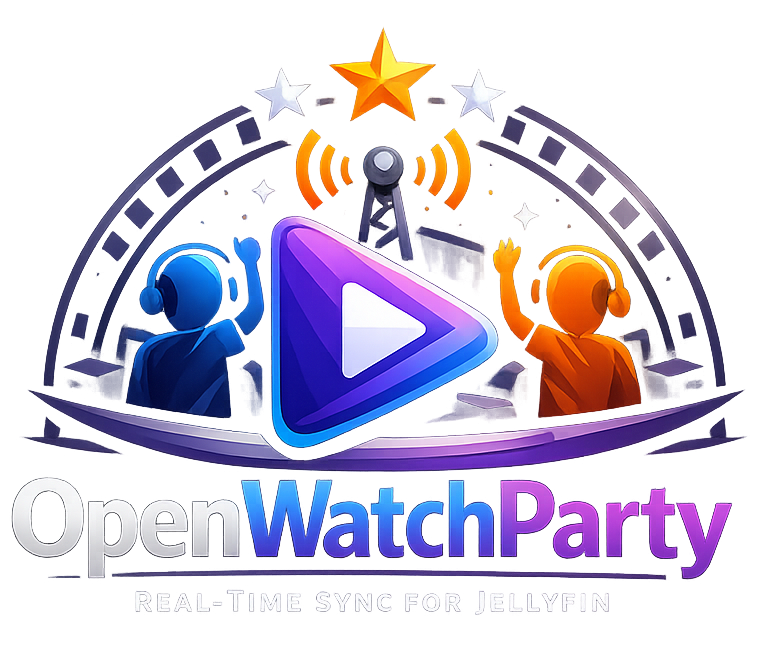

<p align="center">
  
</p>

<p align="center">
  <strong>Watch movies together, no matter the distance.</strong>
</p>

<p align="center">
  <a href="https://github.com/mhbxyz/OpenWatchParty/actions/workflows/ci.yml"></a>
  
  
  
</p>

---

OpenWatchParty enables synchronized media playback for [Jellyfin](https://jellyfin.org/). It consists of a **Jellyfin Plugin** (C#) that integrates the UI and a **Session Server** (Rust) that manages rooms and synchronization via WebSocket.

## Quick Start

### Users

```bash
docker run -d --name owp-session -p 3000:3000 \
  -e ALLOWED_ORIGINS="http://your-jellyfin:8096" \
  ghcr.io/mhbxyz/owp-session-server:latest
```

Then install the plugin from Jellyfin's catalog. See the [Installation Guide](https://mhbxyz.github.io/OpenWatchParty/operations/installation.html) for full instructions.

### Developers

```bash
git clone https://github.com/mhbxyz/OpenWatchParty.git
cd OpenWatchParty
just up
```

See the [Development Setup Guide](https://mhbxyz.github.io/OpenWatchParty/development/setup.html) for the full workflow.

## Documentation

**[mhbxyz.github.io/OpenWatchParty](https://mhbxyz.github.io/OpenWatchParty/)**

## Contributing

- [Report bugs](https://github.com/mhbxyz/OpenWatchParty/issues)
- [Submit pull requests](https://github.com/mhbxyz/OpenWatchParty/pulls)
- [Contributing Guide](https://mhbxyz.github.io/OpenWatchParty/development/contributing.html)

## License

MIT
